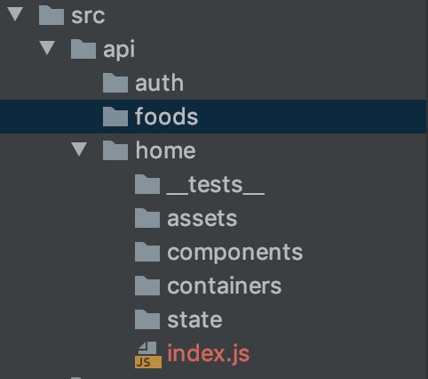
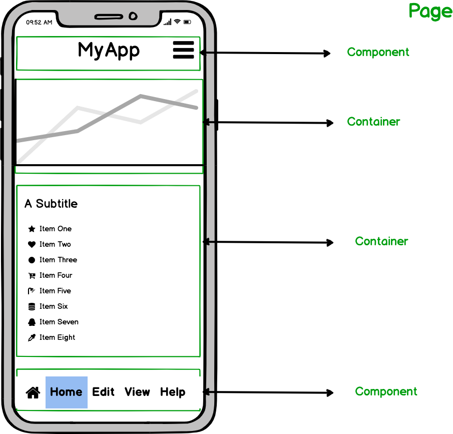

[](https://travis-ci.org/furtadodiegos/react_boirlerplate)

This project was bootstrapped with [Create React App](https://github.com/facebook/create-react-app).

## Idea of this repository

Remind me and be one step-by-step to any React project

## Start

- Create the app

`create-react-app <projectName>`

- Clean the directory "src":

`rm -rf App.css index.css logo.svg`

- Install devDependencies:

`npx install-peerdeps --dev eslint-config-airbnb`

`yarn add react-test-renderer prettier eslint-config-prettier eslint-plugin-prettier`

- Configure ".eslintrc" and ".prettierrc"

```
// .eslintrc

{
  "extends": ["airbnb", "prettier"],
  "plugins": ["prettier", "react"],
  "env": {
    "browser": true,
    "node": true
  },
  "rules": {
    "react/jsx-uses-react": "error",
    "react/jsx-uses-vars": "error",
    "prettier/prettier": ["error"],
    "react/jsx-props-no-spreading": "off"
  }
}
```

```
// .prettierrc

{
  "useTabs": false,
  "printWidth": 100,
  "singleQuote": true,
  "trailingComma": "all",
  "jsxBracketSameLine": false,
  "arrowParens": "always",
  "semi": true
}
```

- Install dependencies

`yarn add @material-ui/core @material-ui/icons @material-ui/styles classnames formik yup prop-types react-placeholder react-redux react-router-dom connected-react-router history react-transition-group redux redux-saga reselect`

- Create dir structure

`cd src && mkdir api configs contexts pages utils`

## DirStructure

#### Api

Grouped by routes and should be like:



#### Configs

Should contain the app configuration.

#### Contexts

Should contain all the context configuration.

#### Pages

Pages are the entry point of each route and should render components and containers

#### Utils

Should contain helpers functions

## Page Structure



#### Component

Don't need to communicate with Redux

#### Container

Communicates with Redux
